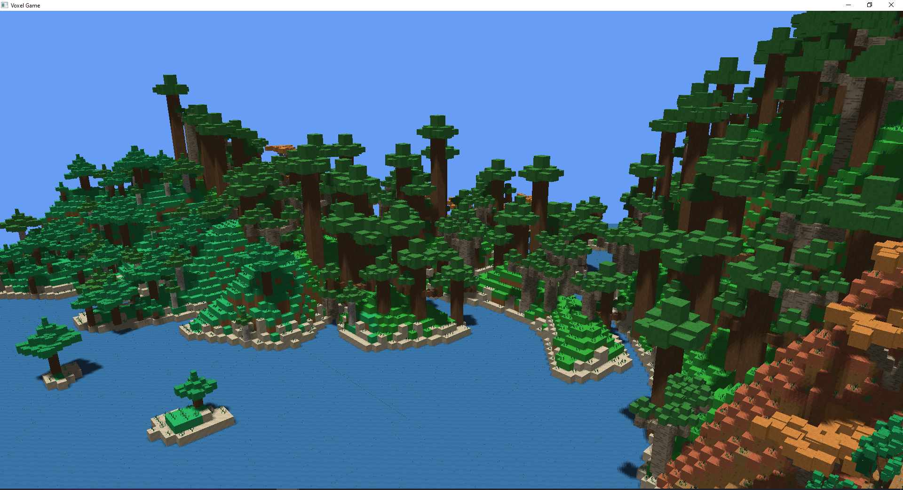

# About
This project is a master thesis text on: **Voxel engine for rendering and generating procedural worlds**.
You can find the source code of the project [here](https://github.com/heppyn/VoxelGame).

This project is written in latex, but has a working draft written in Microsoft Word.
You can check the [PDF with the latest](https://github.com/heppyn/MasterThesis/blob/main/latex/DP_hepner_lukas.pdf) state of the thesis in latex folder.

